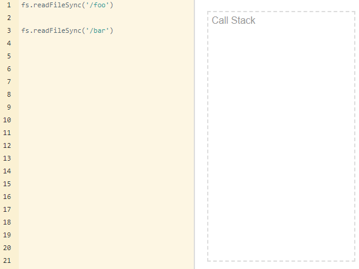
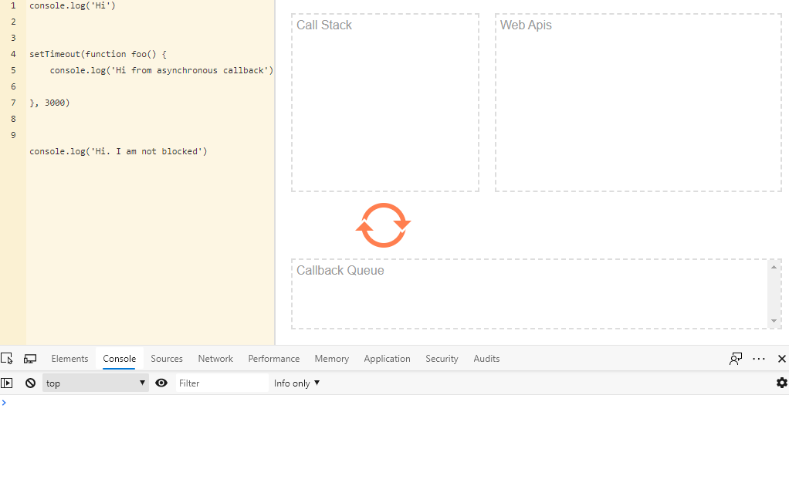

# Asynchronous and Single-threaded JavaScript? Meet the Event Loop

JavaScript is a single-threaded language and, at the same time, also non-blocking, asynchronous and concurrent. This article will explain to you how it happens.

## Runtime

JavaScript is an interpreted language, not a compiled one. This means that it needs an interpreter which converts the JS code to a machine code. There are several types of interpreters (known as engines). The most popular browser engines are V8 (Chrome), Quantum (Firefox) and WebKit (Safari). Incidentally, V8 is also used in a popular non-browser runtime, Node.js.

Each engine contains a memory heap, a call stack, an event loop, a callback queue and a WebAPI with HTTP requests, timers, events, etc., all implemented in its own way for faster and safer interpretation of the JS code.

<p align="center">
    
</p>
<p align="center">
    <em>Basic JS runtime architecture. Author: Alex Zlatkov</em>
</p>

## Single thread

A single-thread language is one with a single call stack and a single memory heap. It means that it runs only one thing at a time.

A `stack` is a continuous region of memory, allocating local context for each executed function.

A `heap` is a much larger region, storing everything allocated dynamically.

A `call stack` is a data structure which basically records where we are in the program.

### Call Stack

Let's write a simple code and track what's happening on the call stack.

<p align="center">
    
</p>

As you can see, the tasks are added to the stack, executed and later deleted. It's the so-called LIFO way - Last In, First Out. Each entry in the call stack is called a `stack frame`.

Knowledge of the call stack is useful for reading error stack traces. Generally, the exact reason for the error is at the top in first line, though the order of code execution is bottom-up.

Sometimes you can deal with a popular error, notified by `Maximum call stack size exceeded`. It is easy to get this using recursion:

```
function foo() {
    foo()
}

foo()
```

and our browser or terminal freezes. Each browser, even their different versions, has a different call stack size limit. In the vast majority of cases, they are sufficient and the problem should be looked for elsewhere.

### Blocked Call Stack

Here is an example of blocking the JS thread. Let's try to read a `foo` file and a `bar` using the Node.js synchronous function `readFileSync`.

<p align="center">
    
</p>

This is a looped GIF. As you see, the JS engine waits until the first call in `readFileSync` is completed. But this will not happen because there is no `foo` file, so the second function will never be called.

## Asynchronous behavior

However, JS can also be non-blocking and behave as if it were multi-threaded. It means that it doesn't wait for the response of an API call, I/O events, etc., and can continue the code execution. It is possible thanks to the JS engines which use (under the hood) real multi-threading languages, like C++ (Chrome) or Rust (Firefox). They provide us with the Web API under the browser hoods or ex. I/O API under Node.js.

<p align="center">
    
</p>

In the GIF above, we can see that the first function is pushed to the call stack and `Hi` is immediately executed in the console.

Then, we call the `setTimeout` function provided by the browser's WebAPI. It goes to the call stack and its asynchronous callback `foo` function goes to the WebApi's queue, where it waits for the call, set to happen after 3 seconds.

In the meantime, the program continues the code and we see `Hi. I am not blocked` in the console.

After it is invoked, each function in the WebAPI queue goes to the `Callback Queue`. It is where functions wait until the call stack is empty. When it happens, they are moved there one by one.

So, when our `setTimeout` timer finishes the countdown, our `foo` function goes to the callback queue, waits until the call stack becomes available, goes there, is executed and we see `Hi from asynchronous callback` in the console.

### Event Loop

The question is, how does the runtime know that the call stack is empty and how is the event in the callback queue invoked? Meet event loop. It is a part of the JS engine. This process constantly checks if the call stack is empty and, if it is, monitors whether there is an event in the callback queue waiting to be invoked.

That's all the magic behind the scenes!

## Wraping up theory

### Concurrency & Parallelism

`Concurrency` means executing multiple tasks at the same time but not simultaneously. E.g. two tasks works in overlapping time periods.

`Parallelism` means performing two or more tasks simultaneously, e.g. performing multiple calculations at the same time.

### Threads & Processes

`Threads` are a sequence of code execution which can be executed independently of one another.

`Process` is an instance of a running program. A program can have multiple processes.

### Synchronous & Asynchronous

In `synchronous` programming, tasks are executed one after another. Each task waits for any previous task to be completed and is executed only then.

In `asynchronous` programming, when one task is executed, you can switch to a different task without waiting for the previous one to be completed.

### Synchronous and Asynchronous in a Single and Multi-threaded Environment

`Synchronous with a single thread`: Tasks are executed one after another. Each task waits for its previous task to get executed.

`Synchronous with multiple threads`: Tasks are executed in different threads but wait for any other executing tasks on any other thread.

`Asynchronous with a single thread`: Tasks start being executed without waiting for a different task to finish. At a given time, only a single task can be executed.

`Asynchronous with multiple threads`: Tasks get executed in different threads without waiting for other tasks to be completed and finish their executions independently.

## JavaScript classification

If we consider how JS engines works under the hood, we can classify JS as an asynchronous and single-threaded interpreted language. The word "interpreted" is very important because it means that the language will always be runtime-dependent and never as fast as compiled languages with built-in multi-threading.

It is noteworthy that Node.js can achieve real multi-threading, provided that each thread is started as a separate process. There are libraries for this, but Node.js has a built-in feature called [Worker Threads](https://nodejs.org/api/worker_threads.html#worker_threads_worker_threads).

All event loop GIFs come from the [Loupe](https://github.com/latentflip/loupe) application created by Philip Roberts, where you can test your asynchronous scenarios.
