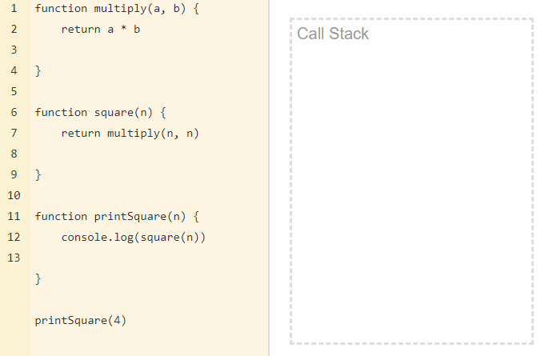

# Event Loop in JavaScript

JavaScript is a single-threaded language but at the same time is also non-blocking, asynchronous and concurrent. This article will explain how it works under the hood.

## Runtime

JavaScript is an interpreted language, not a compiled. This means that it needs an interpreter which convert JS code to machine code. There are several interpreters that we call engines. The most popular browser engines are V8 (Chrome), Quantum (Firefox) and WebKit (Safari). It's worth to note that V8 is also used in popular non browser runtime - Node.js.

Each engine contains memory heap, call stack, event loop, callback queue and WEB API's like HTTP requests, timers, events etc. implemented in own way for faster and safer interpretation of JS code.


<em>Basic JS runtime architecture. Author: Alex Zlatkov</em>

## Single thread

Single-thread language menas that it has one call stack and one memory heap. This in turn means running one thing at a time.

Stack is a continuous region of memory allocating local context for each executing function. Heap is a much larger region storing everything allocated dynamically. Call Stack is a data structure which records basically where in the program we are.

Let's write a simple code and track what's happening on call stack.



As you can see, tasks are added to the stack, executed and later deleted. It works in the LIFO way - Last In, First Out. Each entry in the call stack is called Stack Frame.

Knowledge of call stack is useful for reading errors stack traces. Generally the exact reason of error is on the top at first line but the order of code execution is from the bottom to top.

Sometimes you can deal with popular error `Maximum call stack size exceeded`. It is easy to get this error using recursion.

```
function foo() {
    foo()
}

foo()
```

and our browser or terminal freezes. Different browsers and even their different versions have different call stack size limits.
